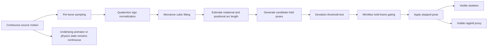
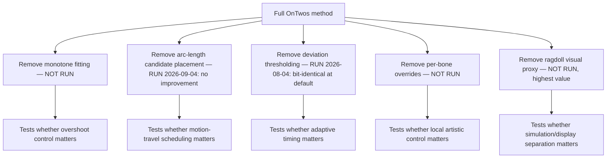

# OnTwos Literature Review for a Short Research Paper

> **Conversion note:** This Markdown version preserves the substantive content of the source PDF while removing page-layout artifacts, repeated page numbers, orphaned superscript link markers, and duplicated raw URLs. The comparison table has been reconstructed as a Markdown table, and the two diagrams have been reconstructed as Mermaid for machine readability.

## Executive Summary

OnTwos sits at the intersection of five literatures rather than inside one established niche: shape-preserving spline interpolation, rotation interpolation on manifolds, motion-capture keyframe selection, real-time stylized skeletal animation, and physics-driven character deformation. The strongest immediate literature anchors for a paper are Fritsch and Carlson's monotone cubic interpolation paper, Fritsch and Butland's local monotone cubic variant, Shoemake's quaternion-curve work, Roberts et al.'s optimal keyframe selection for motion capture, Rohmer et al.'s real-time stylized skeletal animation, and the University of Washington deformable-character line led by Capell and colleagues. Together, these sources supply a credible foundation for OnTwos's main technical components: monotone fitting, geodesic rotation distance, adaptive pose selection, artist control, and the separation of physical simulation from displayed deformation.

The central research finding is that there is strong prior art for each ingredient separately, but very little directly on **real-time stop-motion-style temporal quantization of both skeletal and ragdoll motion inside a game engine**. Roberts et al. frame keyframe selection as an optimization problem for editing and stylization, but do not propose real-time stop-motion stepping. Rohmer et al. show that stylization can be layered onto standard skeletal animation in real time, but focus on velocity-driven deformations rather than temporal quantization. Capell's work shows that simulation and displayed character motion can be decoupled through skeletal constraints and deformable representations, but not for stepped stop-motion playback. Your Consensus seed pointed in the same direction; after verification against primary or near-primary sources, that diagnosis looks substantially correct.

For a six-week short-paper timeline, the literature is good enough. The most defensible contribution statement is not "we invented stop-motion in Unity" and not "we invented PCHIP for animation." It is:

> A real-time, production-oriented method for adaptive temporal quantization of continuous skeletal and physics-driven animation, combining monotone cubic fitting, rotation-aware distance measurement, candidate pose placement along motion arc length, deviation-triggered hold selection, per-bone controls, and a visual-proxy path for ragdolls.

The literature below supports each of those claims separately; the gap is the combination.

> **[SUPERSEDED 2026-09-26 — see `RESEARCH.md` §1.]** This combination statement predates
> the 2026-09-04 placement measurement. Four of its six elements — monotone cubic fitting,
> rotation-aware distance, arc-length candidate placement and deviation-triggered hold
> selection — are now measured either inert at the default setting or no better than a
> uniform metronome at a matched pose budget (`RESEARCH.md` §2a). The contribution of
> record is the claim in `RESEARCH.md` §1. What survives from this document is its gap
> analysis, its bibliography, and its ablation design — not this sentence.

## Search Scope and Source Quality

I prioritized publisher pages, open-access journal pages, university project pages, and author manuscripts. The most authoritative sources in this review are the SIAM journal pages for the PCHIP lineage, the open-access Springer paper by Roberts et al., and the University of Washington project page for the Capell deformable-character work. Author manuscripts on arXiv were used for several recent graphics papers when the publisher page was not readily accessible in-browser.

One important caveat: some classic graphics papers, especially Shoemake's SIGGRAPH paper and the Dam-Koch-Lillholm technical report, were easiest to verify in-browser through widely used secondary reference pages that cite the originals rather than through a clean publisher abstract page. I include them because they are indispensable to the topic, but if you submit a paper, you should still export the final BibTeX entries directly from ACM DL or the original institutional report page before final submission.

## Foundational Interpolation and Rotation Literature

### Monotone cubic interpolation and animator-controlled splines

#### Fritsch & Carlson (1980)

**Fritsch, F. N., & Carlson, R. E. (1980). _Monotone Piecewise Cubic Interpolation_. SIAM Journal on Numerical Analysis, 17(2), 238-246.**  
DOI: https://doi.org/10.1137/0717021

This is the core mathematical anchor for any PCHIP-style argument. The paper derives necessary and sufficient conditions for a cubic to remain monotone on an interval and uses those conditions to construct a visually pleasing monotone piecewise-cubic interpolant for monotone data. The result is exactly the kind of shape-preserving behavior OnTwos wants when fitting recently sampled motion without introducing overshoot artifacts that would create false pose candidates or misleading deviation peaks. For OnTwos, the paper is directly relevant to PCHIP fitting and indirectly to deviation thresholding, because overshoot in the fitted curve would pollute any threshold-driven hold decision.

#### Fritsch & Butland (1984)

**Fritsch, F. N., & Butland, J. (1984). _A Method for Constructing Local Monotone Piecewise Cubic Interpolants_. SIAM Journal on Scientific and Statistical Computing, 5(2), 300-304.**  
DOI: https://doi.org/10.1137/0905021

This paper proposes a local method for producing monotone piecewise-cubic interpolants to monotone data and emphasizes that the method is both fully local and simple to implement. That matters for OnTwos because a rolling-window runtime tool benefits from a local rule set more than from a globally coupled spline construction. If your implementation updates splines continuously while sampling live animation or ragdoll motion, Fritsch-Butland is arguably the most implementation-friendly monotone-cubic reference for a runtime system. It maps most directly to PCHIP fitting and to the practical engineering case for doing it online.

#### Kochanek & Bartels (1984)

**Kochanek, D. H. U., & Bartels, R. H. (1984). _Interpolating Splines with Local Tension, Continuity, and Bias Control_. SIGGRAPH '84.**  
Secondary overview URL used in the review: https://en.wikipedia.org/wiki/Kochanek%E2%80%93Bartels_spline

Although this is not a monotonicity-preserving method, it is a classic animation-curve reference because it makes tangent behavior artist-addressable through tension, continuity, and bias. The relevance to OnTwos is comparative: if you position OnTwos against older animation-curve practice, Kochanek-Bartels represents the animator-centered Hermite tradition, whereas Fritsch-Carlson/Fritsch-Butland represent the shape-preserving numerical-analysis tradition. That contrast helps justify why monotone cubic fitting is not just "another spline," but a deliberate choice to suppress overshoot and preserve recent motion trends before pose quantization. It is thus best framed as an alternative baseline or conceptual foil for PCHIP fitting.

### Quaternion interpolation and motion arc length

#### Shoemake (1985)

**Shoemake, K. (1985). _Animating Rotation with Quaternion Curves_. SIGGRAPH '85, Computer Graphics, 19(3), 245-254.**  
DOI commonly cited as: https://doi.org/10.1145/325334.325242

Shoemake is the canonical reference for quaternion interpolation in graphics, especially SLERP and quaternion curves. The key idea for OnTwos is not merely "use quaternions," but that a rotation interpolation should respect the geometry of the rotation manifold rather than rely on Euclidean interpolation of Euler angles. In practical terms, this is the strongest literature basis for measuring or approximating rotational arc length through geodesic angle and for arguing that hold-candidate placement should follow rotational travel, not raw frame count. It is most relevant to arc-length candidate placement and to any geodesic deviation thresholding over rotations.

#### Dam, Koch & Lillholm (1998)

**Dam, E. B., Koch, M., & Lillholm, M. (1998). _Quaternions, Interpolation and Animation_. Technical Report, University of Copenhagen.**  
Secondary overview URL used in the review: https://en.wikipedia.org/wiki/Spherical_linear_interpolation

This technical report became a standard practical reference for quaternion interpolation, covering SLERP and common animation-use tradeoffs. Its value for OnTwos is pragmatic: it helps justify sign-consistent quaternion handling, shortest-path interpolation intuition, and the interpretation of quaternion distance as an angular quantity suitable for motion accumulation and thresholding. If your paper needs a concise engineering justification for using quaternion angle as a proxy for motion magnitude, this report is one of the most relevant technical-report citations. It maps to arc-length candidate placement and deviation thresholding.

#### QuaterNet (2018)

QuaterNet authors explicitly argue that Euler-angle and exponential-map parameterizations can suffer discontinuities, whereas quaternion representations avoid several of those issues in sequence modeling. In their 2018 manuscript, Pavllo, Grangier, and Auli represent motion with quaternions and penalize forward-kinematic position error, reporting improved short-term prediction and realistic long-term generation. This is not directly an interpolation paper, but it is a strong modern source for why runtime articulated motion systems should work in a quaternion-native representation when possible. For OnTwos, it strengthens the rationale behind quaternion-aware deviation thresholding and helps motivate sign normalization before fitting or comparison.

**Citation:** Pavllo, D., Grangier, D., & Auli, M. (2018). _QuaterNet: A Quaternion-based Recurrent Model for Human Motion_. arXiv.  
URL: https://arxiv.org/abs/1805.06485

## Motion Keyframe Selection and Temporal Stylization

### Keyframe selection as the closest direct precedent

#### Roberts et al. (2019)

**Roberts, R., Lewis, J. P., Anjyo, K., Seo, J., & Seol, Y. (2019). _Optimal and Interactive Keyframe Selection for Motion Capture_. Computational Visual Media, 5, 171-191.**  
DOI / article page: https://link.springer.com/article/10.1007/s41095-019-0138-z

This is the single closest peer-reviewed paper to OnTwos's stepping logic. Roberts et al. observe that large stylistic edits to motion capture often force artists to re-animate by manually selecting keyframes, then recast the problem as automatic optimal keyframe selection. Their method formulates the keyframe-set problem as a shortest-path problem solved with dynamic programming and reports that motion can be simplified to roughly 10% of the original number of frames while preserving most details, outperforming both prior research algorithms and a leading commercial tool. For OnTwos, this paper is the strongest direct prior for deviation-driven pose selection and for the general idea that stylization can arise from a reduced subset of poses rather than from replaying every source frame. It does not supply real-time stop-motion playback or ragdoll support, which is exactly where your gap begins.

Roberts et al. are also valuable because their related-work section surfaces the principal pre-2019 keyframe-extraction families. They explicitly cite entropy-based motion extraction by So and Baciu, multiscale motion saliency by Çakmak and Capin, and optimization-based keyframe extraction by Liu, Hao, and Zhao as representative prior approaches. Even when you do not reopen every one of those papers in depth, Roberts gives you a defensible way to position OnTwos relative to the existing keyframe-selection literature: prior work focused on saliency, entropy, or offline optimization for motion simplification, whereas OnTwos is a runtime stylization system that quantizes live motion into hold poses.

The key predecessors that Roberts identifies are these:

#### So & Baciu (2005)

**So, C. K. F., & Baciu, G. (2005). _Entropy-based Motion Extraction for Motion Capture Animation_. Computer Animation and Virtual Worlds, 16(3-4), 225-235.**  
DOI: https://doi.org/10.1002/cav.107

From title and Roberts's placement, this paper is a representative information-theoretic baseline: it seeks informative motion moments using entropy rather than explicit optimization over reconstruction fidelity. It is relevant to OnTwos as a baseline family for deviation thresholding and pose importance scoring, but less relevant to PCHIP fitting or ragdoll proxy.

#### Çakmak & Capin (2011)

**Çakmak, H., & Capin, T. (2011). _Multiscale Motion Saliency for Keyframe Extraction from Motion Capture Sequences_. Computer Animation and Virtual Worlds, 22(1), 3-14.**  
DOI: https://doi.org/10.1002/cav.380

Again, Roberts positions this as a saliency-based baseline. It is especially relevant if you want to argue that OnTwos's deviation thresholding is closer to a motion-significance measure than to fixed-FPS frame dropping. The likely contrast is that saliency methods identify perceptually or structurally important moments offline, whereas OnTwos emits hold poses online from rolling motion history.

#### Liu, Hao & Zhao (2013)

**Liu, X.-M., Hao, A.-M., & Zhao, D. (2013). _Optimization-based Key Frame Extraction for Motion Capture Animation_. The Visual Computer, 29(1), 85-95.**  
DOI / article page: https://link.springer.com/doi/10.1007/s00371-012-0676-1

This is the most conceptually important predecessor among the three because it already frames keyframe extraction as an optimization problem, making it a natural antecedent to Roberts and, indirectly, to OnTwos. Its closest relevance is to deviation thresholding and to your evaluation baselines: one strong baseline for a paper would be an offline or quasi-offline error-minimizing keyframe extraction versus OnTwos's online thresholded stepping.

### Stylization literature adjacent to stop-motion

#### Rohmer et al. (2021)

**Rohmer, D., Tarini, M., Kalyanasundaram, N., Moshfeghifar, F., Cani, M.-P., & Zordan, V. (2021). _Velocity Skinning for Real-time Stylized Skeletal Animation_. Author manuscript.**  
URL: https://arxiv.org/abs/2104.04934

Rohmer et al. propose a real-time method for adding stylized secondary motion on top of ordinary skeletal animation by deriving deformations from linear and angular velocities along the hierarchy. They emphasize real-time performance, GPU suitability, and artist control through painted weights. For OnTwos, the paper is not about temporal quantization, but it is an excellent citation for the broader argument that stylization in real-time character pipelines matters, can be layered over standard rigs, and benefits from local or per-bone artist control. It links most strongly to per-bone control and to the positioning of OnTwos as a real-time stylization tool rather than a pure offline animation-processing method.

#### PhysAnimator (2025)

PhysAnimator is a more distant but still interesting adjacency. Xie et al. combine physics-based simulation with generative methods to produce anime-stylized animation from static illustrations, using deformable-body simulation, controllable rigging points, and sketch-guided synthesis. This is not a direct baseline for OnTwos, but it shows that the modern stylization literature increasingly combines physical plausibility and explicit artistic control rather than choosing only one. If you want a "future work" citation, it suggests a path toward hybrid systems in which OnTwos-like temporal quantization could eventually be learned or perception-tuned.

**Citation:** Xie, T., Zhao, Y., Jiang, Y., & Jiang, C. (2025). _PhysAnimator: Physics-Guided Generative Cartoon Animation_. arXiv.  
URL: https://arxiv.org/abs/2501.16550

The negative result is just as important as the positive one: I did not find a robust, peer-reviewed subliterature specifically on **"animate-on-twos" game-engine motion quantization for real-time skeletal and ragdoll playback**. The nearest verified papers are about keyframe selection, stylized skeletal deformation, and physically based character rigs, which is exactly why OnTwos can plausibly claim novelty in the combination. Your own Consensus seed independently flagged that missing middle.

## Real-Time Skeletal and Physics-Based Systems

### Simulation-display separation and deformable-character systems

The University of Washington's Deformable Characters project page is one of the most useful near-primary sources for the Capell line of work because it lists the papers, dissertation, publication venues, and accompanying videos in one place. The project's stated goal is to create efficient, user-friendly methods for simulating deformable characters while giving animators control over pose and shape within an elastic-simulation framework. That framing is highly relevant to OnTwos: it is one of the clearest precedents for saying that a character system may maintain one representation for physically meaningful motion and another for controllable displayed motion.

Project page: https://grail.cs.washington.edu/projects/deformation/

#### Capell et al. (2002)

**Capell, S., Green, S., Curless, B., Duchamp, T., & Popović, Z. (2002). _Interactive Skeleton-Driven Dynamic Deformations_. Proceedings of ACM SIGGRAPH 2002.**  
Project URL: https://grail.cs.washington.edu/projects/deformation/

From the project page and overview, this paper belongs to a line where the skeleton acts as a constraint system for an elastic simulation rather than merely driving a surface by standard skinning. The page's videos explicitly show a cow animated via an underlying skeleton, with secondary flesh motion simulated in real time. For OnTwos, the key relevance is architectural: the visible output need not be identical to the raw driver representation. That is the closest academic precedent to a ragdoll proxy argument, even though the exact use case is secondary deformation rather than stepped playback.

#### Capell (2004)

**Capell, S. (2004). _Interactive Character Animation Using Dynamic Elastic Simulation_. Ph.D. Dissertation, University of Washington.**  
Project URL: https://grail.cs.washington.edu/projects/deformation/

The dissertation is relevant because dissertations often provide the full systems rationale missing from shorter conference papers. The project-page summary makes clear that the larger agenda was interactive character animation through dynamic elastic simulation. In an OnTwos paper, Capell's dissertation is useful primarily as a systems antecedent: it helps situate the claim that physically driven characters often need a carefully designed intermediate representation to remain performant, controllable, and visually plausible.

#### Capell et al. (2005)

**Capell, S., Burkhart, M., Curless, B., Duchamp, T., & Popović, Z. (2005). _Physically Based Rigging for Deformable Characters_. Symposium on Computer Animation 2005; extended version in Graphical Models 69, 71-87, 2007.**  
Project URL: https://grail.cs.washington.edu/projects/deformation/

This is one of the most directly useful citations for the proxy/rig separation theme. The project page presents it as physically based rigging for deformable characters, and the surrounding project description emphasizes that the system is trying to combine animator control with an elastic simulation paradigm. In your paper, this is a strong precedent for saying that a physically valid internal model and an artistically presented visible model may purposefully diverge. That is conceptually very close to OnTwos's ragdoll proxy strategy.

### Motion-editing systems and high-level control

The allied Motion Libraries for Character Animation project page from the same group describes motion as an optimal dynamic process and emphasizes editing high-level properties such as footprint timing, placement, limb lengths, mass, and joint arrangement. Even though this page is not directly about stepping or stop-motion, it is important supporting literature for the notion that practical animation tools should expose high-level motion controls rather than raw low-level frames. That principle is closely aligned with OnTwos's tunable thresholds, hold-duration controls, and per-bone overrides.

Project page: https://grail.cs.washington.edu/projects/charanim/

### Modern physics-based rigging analogues

#### PhysRig (2025)

**Zhang, H., Xu, H., Feng, C., Jampani, V., & Ahuja, N. (2025). _PhysRig: Differentiable Physics-Based Skinning and Rigging Framework for Realistic Articulated Object Modeling_. arXiv.**  
URL: https://arxiv.org/abs/2506.20936

PhysRig is not a direct predecessor to OnTwos, but it is a useful modern analogue. The paper criticizes standard linear blend skinning for unrealistic deformations and instead embeds a rigid skeleton inside a volumetric physically simulated representation. The relevance to OnTwos is conceptual rather than algorithmic: both systems are motivated by the limits of directly displaying the raw driver state. PhysRig treats the problem as one of deformation realism, while OnTwos treats it as stylized temporal playback, but in both cases the visible character is not simply a naive readout of the underlying simulation. That makes PhysRig a good forward-looking citation for ragdoll proxy and for broader "physics-aware display" positioning.

## Comparison Table

The table below summarizes the core verified corpus most relevant to an OnTwos paper. "Uses arc length" means it either directly uses geodesic/angular arc length or provides the mathematical basis for doing so. "Uses monotone cubic/PCHIP" means the method is explicitly monotone-cubic or shape-preserving Hermite, not merely cubic. These classifications are taken from the cited abstracts, project pages, or, where noted, standard secondary summaries of canonical works.

| Paper | Problem addressed | Real-time? | Skeletal? | Physics? | Uses arc length? | Uses monotone cubic / PCHIP? | Evaluation type |
|---|---|---|---|---|---|---|---|
| Fritsch & Carlson 1980 | Shape-preserving interpolation of monotone data | No | No | No | No | Yes | Theoretical analysis + examples |
| Fritsch & Butland 1984 | Local monotone cubic interpolation | No | No | No | No | Yes | Method + implementation simplicity |
| Kochanek & Bartels 1984 | Animator-controlled cubic Hermite motion curves | Not the focus | No | No | No | No | Animation-curve design examples |
| Shoemake 1985 | Quaternion rotation interpolation and curves | Practical graphics use | No | No | Yes | No | Canonical method paper |
| Dam et al. 1998 | Practical quaternion interpolation for animation | Practical | No | No | Yes | No | Technical-report synthesis |
| Roberts et al. 2019 | Optimal keyframe selection for mocap | Offline | Yes | No | No | No | Quantitative comparison + tool comparison |
| Rohmer et al. 2021 | Real-time stylized skeletal animation via velocity skinning | Yes | Yes | Indirectly stylized physical behavior | No | No | Interactive demos + performance |
| Capell et al. 2002 | Interactive skeleton-driven dynamic deformations | Yes | Yes | Yes | No | No | Interactive demos + videos |
| Capell 2004 dissertation | Interactive character animation with dynamic elastic simulation | Yes | Yes | Yes | No | No | Dissertation-scale systems study |
| Capell et al. 2005 | Physically based rigging for deformable characters | Yes / interactive rigging context | Yes | Yes | No | No | Paper + award-recognized examples |
| QuaterNet 2018 | Quaternion-based skeletal motion representation | Model inference, not tool-focused | Yes | No | Indirectly geodesic-aware | No | Quantitative prediction benchmarks |
| PhysRig 2025 | Physics-based skinning and rigging | Not primarily real-time | Yes | Yes | No | No | Quantitative synthetic benchmarks |
| PhysAnimator 2025 | Physics-guided stylized cartoon animation | Not primarily real-time | Partly via rigging support | Yes | No | No | Quantitative + qualitative generative evaluation |

## Implications for OnTwos

The literature supports a clean decomposition of OnTwos into publishable components.

The **mathematical legitimacy** of monotone fitting is supported by Fritsch-Carlson and Fritsch-Butland. That gives you a strong answer to "why not just use Catmull-Rom or a generic cubic?": because the purpose is not only smoothness, but avoiding overshoot and preserving local motion shape before discrete pose selection.

The **rotation legitimacy** of arc-length-aware logic is supported by the quaternion corpus. Shoemake and the Dam report give you the language to say that rotational motion should be understood on a spherical/geodesic manifold with meaningful angular travel, not just as component-by-component Euclidean displacement. That is the strongest basis for framing OnTwos's pose-candidate placement as **arc-length aware** rather than "every N frames."

> **[REVISED 2026-09-26.]** The paragraph above is still useful, but its conclusion
> inverts. Arc-length placement was measured against a metronome at a matched budget and
> did not place poses closer to the motion's extrema (`RESEARCH.md` §2a). What the
> quaternion corpus now legitimises is the *measurement*: geodesic angle is the correct
> distance on SO(3), which is what makes the null result trustworthy rather than an
> artefact of a badly chosen metric. These citations are load-bearing for the negative
> result, not for the feature.

The **motion-selection legitimacy** for choosing a subset of poses is supported most directly by Roberts et al. Their paper is effectively the peer-reviewed bridge between continuous motion and sparse editable pose sets. OnTwos then extends that idea into a runtime stylization context, replacing offline optimization with online thresholded scheduling.

The **artist-control legitimacy** of exposing local controls is strongly supported by Rohmer et al. They show that a real-time stylization tool becomes practically valuable when artists can localize and tune the effect. That is exactly the right citation family for defending **per-bone control** in OnTwos.

The **ragdoll-proxy legitimacy** is supported indirectly but convincingly by the Capell line and, more recently, PhysRig. These works all assume that the representation one simulates and the representation one shows or rigs need not be identical. OnTwos's contribution is to bring that separation to a temporal-stylization problem: keep the physical ragdoll physically correct, while the visible proxy is deliberately stepped. That appears to be a genuine niche not directly occupied by the surveyed literature.

## Suggested Mermaid Diagram for the Paper Pipeline

This diagram is directly motivated by the link between monotone interpolation, geodesic/rotation-aware comparison, sparse pose selection, and simulation/display separation in the surveyed literature.

## Suggested Mermaid Diagram for Ablations

## Gaps and Open Questions

The most important controversy for an OnTwos paper is methodological rather than bibliographic: **should quaternion motion be fitted component-wise with sign correction, or should fitting occur directly on the rotation manifold?** The surveyed literature gives strong support for geodesic quaternion comparison and quaternion-native representation, but it does not straightforwardly endorse component-wise PCHIP as the geometrically ideal solution. That does not make your method invalid; it makes it an explicitly practical approximation, and your paper should say so. Shoemake and modern quaternion-based motion work together justify why this is a real question rather than a cosmetic implementation detail.

A second unresolved issue is what "arc length" should mean for articulated motion stylization. Should it be per-bone quaternion angle, root-space displacement, weighted joint-space travel, or some perceptual surrogate? The literature strongly justifies geodesic angular distance for individual rotations, but there is no standard peer-reviewed recipe in the surveyed corpus for aggregating whole-character travel into stepped pose candidates the way OnTwos appears to do. That is a gap, but also a defensible contribution if you frame your chosen metric clearly and evaluate it empirically.

A third gap is perceptual evaluation of temporal stylization. Keyframe-selection papers evaluate reconstruction fidelity and editing utility; stylized skeletal-animation papers evaluate plausibility, interactivity, and artistic control; physics-rig papers evaluate deformation realism. What is largely missing is a standardized perceptual benchmark for "intentional stop-motion look" versus "mere choppiness." For OnTwos, that means even a modest user study would carry unusual weight.

The final and perhaps most publishable gap is **physics-driven temporal stylization using a visible proxy**. The literature provides many examples of simulation/display separation and many examples of stylizing authored skeletal motion, but I did not find a strong peer-reviewed paper that does exactly what OnTwos is poised to do: preserve continuous ragdoll simulation while intentionally stepping only the rendered proxy to evoke stop-motion timing. Because the literature around this exact formulation is so sparse, the burden on your paper will be experimental clarity rather than citation quantity. If you can show that the proxy avoids physics instability, preserves recognizability of the source motion, and is preferred over naive frame dropping, then the contribution is both interesting and well motivated.

For a six-week short-paper schedule, the minimum defensible literature core is therefore: **Fritsch & Carlson, Fritsch & Butland, Shoemake, Dam et al., Roberts et al., Rohmer et al., and the Capell deformable-character line.** Everything else is enrichment. That core is already enough to support a literature review, method framing, and a precise novelty statement for OnTwos.

## Reference Links

- Fritsch & Carlson (1980): https://doi.org/10.1137/0717021
- Fritsch & Butland (1984): https://doi.org/10.1137/0905021
- Kochanek-Bartels spline secondary overview: https://en.wikipedia.org/wiki/Kochanek%E2%80%93Bartels_spline
- Shoemake (1985): https://doi.org/10.1145/325334.325242
- Spherical linear interpolation secondary overview used for Dam et al.: https://en.wikipedia.org/wiki/Spherical_linear_interpolation
- QuaterNet (2018): https://arxiv.org/abs/1805.06485
- Roberts et al. (2019): https://link.springer.com/article/10.1007/s41095-019-0138-z
- So & Baciu (2005): https://doi.org/10.1002/cav.107
- Çakmak & Capin (2011): https://doi.org/10.1002/cav.380
- Liu, Hao & Zhao (2013): https://link.springer.com/doi/10.1007/s00371-012-0676-1
- Rohmer et al. (2021): https://arxiv.org/abs/2104.04934
- PhysAnimator (2025): https://arxiv.org/abs/2501.16550
- University of Washington Deformable Characters project: https://grail.cs.washington.edu/projects/deformation/
- University of Washington Motion Libraries for Character Animation project: https://grail.cs.washington.edu/projects/charanim/
- PhysRig (2025): https://arxiv.org/abs/2506.20936
